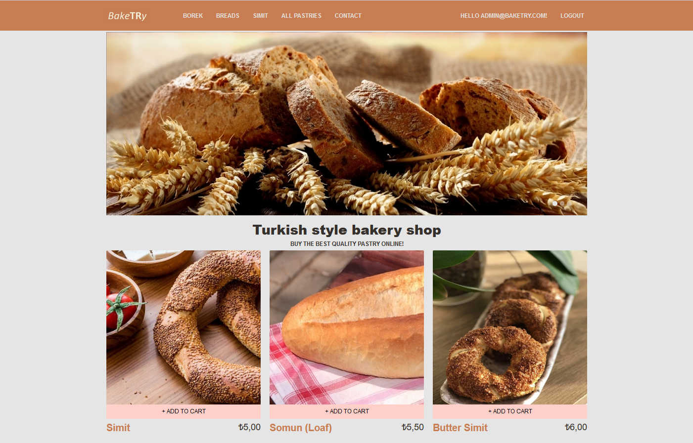
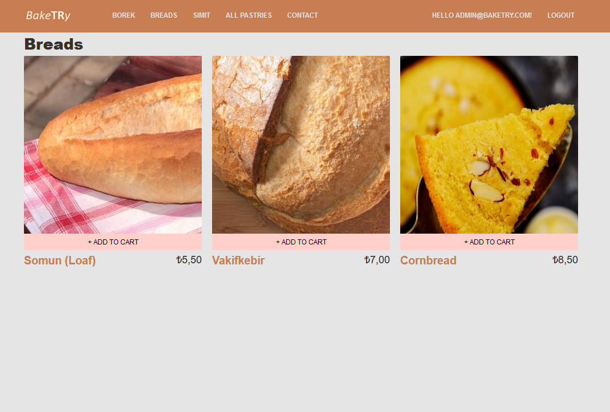
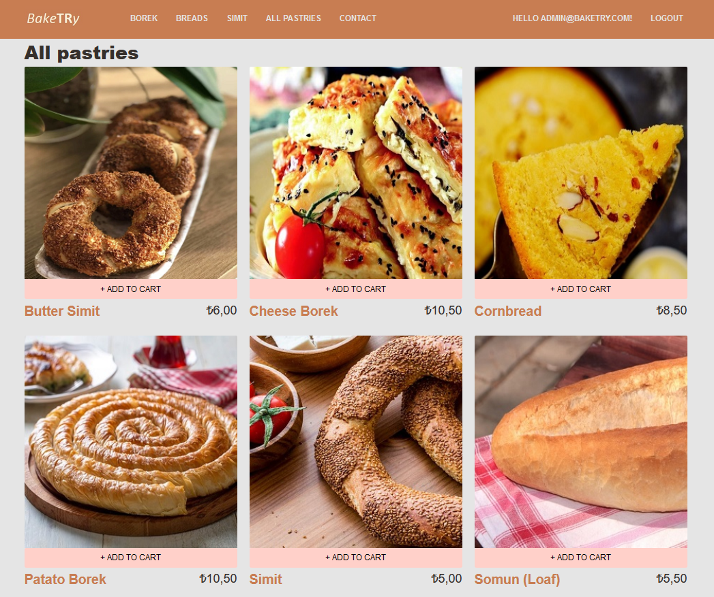

# BakeTRy

This repository contains a fictional bakery shop online shopping web site. The site created for the famous turkish pastry Simit's sake :) which is my favorite.
The Asp.Net Core 7 Framework functionalities and components used in in this application is listed below;
* Asp.Net Core 7 Identity
* Asp.Net Core MVC and View Models
* Asp.Net Core Razor Pages
* Asp.Net Core Web API
* Custom Tag Helpers
* Custom View Components
* Entity Framework Core 7
* XUnit
* Moq

---
### Some Application Screen Shots

1. <h4><b>Home Page</b></h4> 

2. <h4><b>Pastry List of Particular Category</b></h4> 

3. <h4><b>Pastry List of All Categories </b></h4> 

